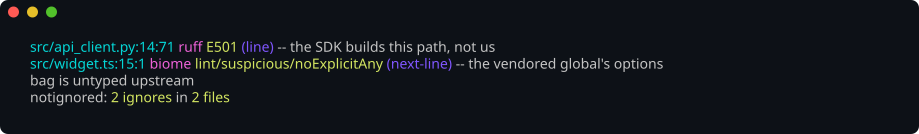
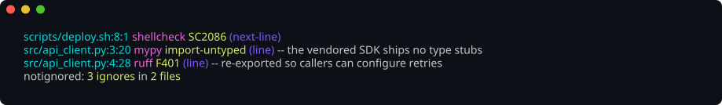
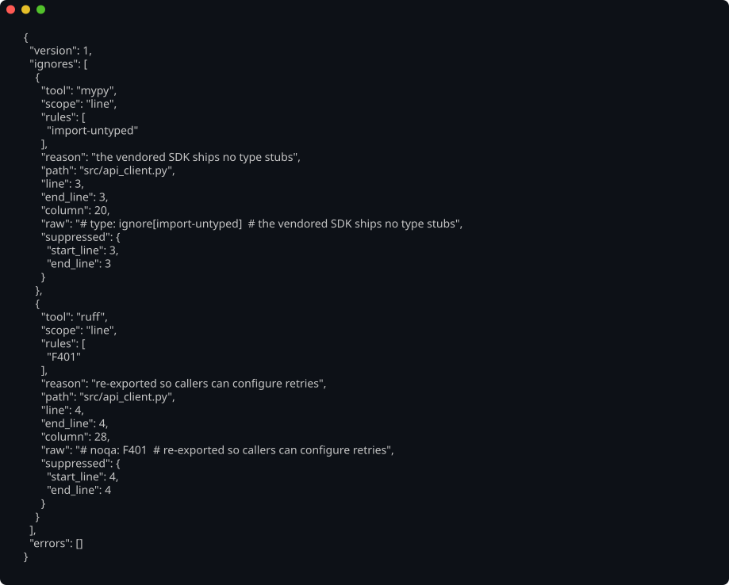
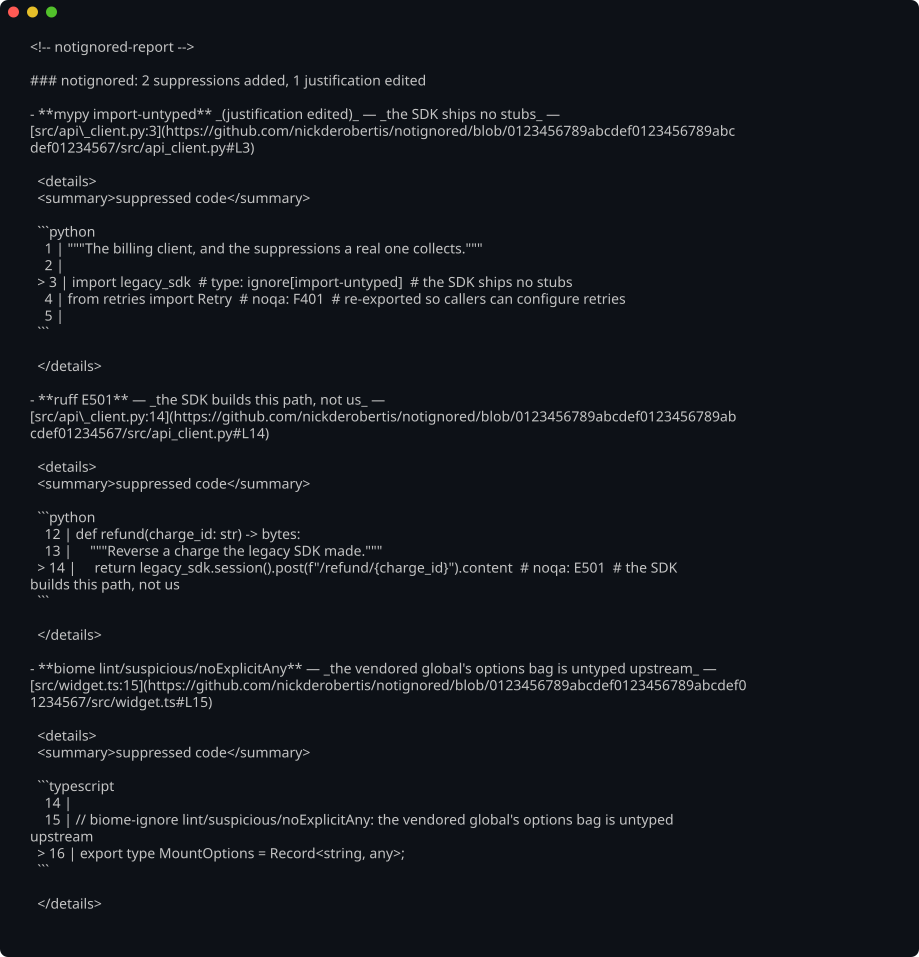

# notignored


Find every lint and type-check suppression comment in a codebase — natively, and
fast.


A reviewer cares about the suppressions a change *introduces*, not the inventory
it inherited, so `--diff` reports only those:



<details>
<summary>Narrowing to particular tools, the JSON envelope, and the pull-request comment</summary>

`--tool`, repeated, reports only the checkers you name:



`--format json` emits the full report envelope — every field of every record,
documented [below](#output):



`--format markdown` renders the body the [GitHub Action](#on-a-pull-request-the-github-action)
posts, with each suppression linked to its line and its silenced code one click
away:



</details>

> These are real captures of the CLI, rendered from its actual colorized output
> by [`just screenshots`](screenshots/AGENTS.md) and gated by
> [screencomp](https://github.com/nickderobertis/screencomp) — so they change
> only when the output does.

## Why

Suppression comments are where lint and type-check debt hides. A `# noqa` costs
one line to add and scrolls past review unremarked — especially in agent-written
code, where silencing a rule is often easier than fixing it.

`notignored` turns every suppression into a first-class, queryable record: which
tool, which rules, the stated reason, and exactly where it lives. That makes a
high-level review of a large change possible — you can see the bypasses and their
justifications without reading every line.

It parses the directives itself and **never invokes the tool whose rule is being
silenced**, so scanning a tree costs a read and a scan instead of ten linter
startups. That is what makes it cheap enough to run on every pull request.

## Install

```console
# From PyPI or npm — both ship the prebuilt binary, so no Rust toolchain is
# needed and nothing is compiled at install time:
pip install notignored-cli
npm install -g notignored-cli

# Or without installing at all:
npx notignored-cli src/

# Cross-platform, from source (Linux, macOS, Windows):
cargo install --git https://github.com/nickderobertis/notignored --locked

# Or a prebuilt binary (Linux, macOS, and Windows under a POSIX shell):
curl -fsSL https://raw.githubusercontent.com/nickderobertis/notignored/main/scripts/install.sh | sh
```

All four install the same `notignored` command. The `notignored-cli`
distributions carry the release binary for your platform — a wheel per platform
on PyPI, a package per platform on npm, picked automatically — so they are the
fastest path on a CI image with no Rust toolchain, and the only one that works
where github.com is blocked but the package registries are not. Prebuilt targets
are Linux (x64, arm64), macOS (x64, arm64), and Windows (x64); anywhere else,
`cargo install` builds from source.

The installer honours `NOTIGNORED_VERSION` / `NOTIGNORED_INSTALL_DIR` (or the
`--version` / `--to` flags), verifies the archive against the SHA-256 checksum
published beside it, and refuses to install a binary it cannot verify. Every
tagged release attaches per-platform archives built on native runners.

In CI there is nothing to install: the [GitHub Action](#on-a-pull-request-the-github-action)
fetches the release binary itself and posts what the pull request added.

```yaml
- uses: nickderobertis/notignored@main
```

## Try it

[`examples/`](examples) holds a handful of tiny files — Python, TypeScript,
shell, Rust — each carrying the kind of suppression, and the kind of reason,
real code collects. Point the binary at them:

```console
$ notignored examples/
examples/api_client.py:3:20 mypy import-untyped (line) -- the vendored SDK ships no type stubs
examples/api_client.py:4:28 ruff F401 (line) -- re-exported so callers can configure retries
examples/deploy.sh:8:1 shellcheck SC2086 (next-line) -- the flags file is ours, and has to split into separate arguments
examples/deploy.sh:13:3 llmlint tool_output_is_signal (file) -- example input the README quickstart scans, not a script this project runs
examples/retry.rs:6:1 rust dead_code (next-line) -- the scheduler starts calling this once backoff lands
examples/widget.ts:6:3 eslint no-console (next-line) -- the mount path is traced in production
examples/widget.ts:9:3 typescript * (next-line) -- the vendored analytics global is declared without its options bag
notignored: 7 ignores in 4 files
```

Seven suppressions, seven tools, one pass over four files — no linter was run. Each
line is `path:line:column tool rules (scope) -- reason`; `--format json` gives
the same records as the envelope [below](#output), and `--format markdown` gives
the comment the action posts. That block is checked against the real binary by
`tests/e2e/examples.rs`, so it is output, not an illustration.

## Usage

```
notignored [PATHS...] [--format human|json|markdown] [--color auto|always|never]
           [--tool NAME]... [--fail-if-found] [--diff [--diff-base REF]]
           [--github-repo OWNER/REPO] [--github-sha SHA] [--max-entries N]
```

- `PATHS` — files and/or directories. Directories are walked recursively,
  honouring `.gitignore`. Defaults to `.`.
- `--format` — `human` (default), `json`, or `markdown` (a pull-request comment
  body; see the action below).
- `--color` — when to colorize the `human` report. `auto` (the default) colors
  only an interactive terminal, `always` forces it, `never` disables it.
- `--tool` — only report this tool; repeat to allow several. Omit for all.
- `--fail-if-found` — exit 1 when any suppression is reported.
- `--diff` — report only the suppressions the change added (see below).
- `--diff-base` — the git revision or range `--diff` compares against.
- `--github-repo` / `--github-sha` — the `owner/repo` and commit the `markdown`
  format builds its permalinks from.
- `--max-entries` — how many suppressions the `markdown` format lists before it
  closes with a line counting the rest. Defaults to 20; must be at least 1.

The `human` report is **colorized** — the location, the tool, the rules, the
scope, and the reason each get their own role, and a blanket `*` is red because
it silences every rule the tool has. Coloring follows the
[`NO_COLOR`](https://no-color.org) convention (and `TERM=dumb`) and the
`--color` flag: `auto` colors only an interactive terminal, `always` forces it
(through a pager, or to capture a screenshot), `never` disables it. The `json`
and `markdown` formats are never colorized — they are contracts, not
presentation, and are byte for byte the same whatever `--color` says.

### Reviewing a pull request

A reviewer cares about the suppressions a change *introduces*, not the
inventory it inherited. `--diff` reports only those: a directive is new when the
diff added at least one of the lines it occupies.

```console
$ notignored --diff --diff-base main --fail-if-found
src/app.py:42:20 ruff E501 (line) -- long wrapped URL
notignored: 1 ignore in 1 file
```

- Bare `--diff` compares the work tree — staged *and* unstaged — against `HEAD`.
- `--diff-base REF` takes any git revision or range. A **plain ref** is compared
  from the **merge base**, the way a pull request's "Files changed" is, so
  commits that landed on the base branch after this one forked are never
  reported as this branch's own. An explicit `A..B` **range** is passed to git
  as-is, two-dot semantics and all. These are llmlint's `--diff` / `--diff-base`
  semantics exactly.
- `PATHS` still narrow the result: `notignored --diff --diff-base main src/`
  reports the new suppressions under `src/` only. An empty intersection is a
  clean exit 0.
- Only the files the change touched are read, so a diff run stays fast on a
  large repository. Files the change deleted are skipped; a renamed file reports
  what the change added to it, not the lines that merely moved.
- Git names a file in bytes and a report names it with a string, so a path that
  is not valid UTF-8 has no faithful spelling here. It becomes an `errors` entry
  (and exit 2) rather than a file quietly dropped from the review — the lossy
  spelling would name a file that does not exist.

`--diff` shells out to `git` — infrastructure, not one of the linters whose
directives are parsed natively — so it needs `git` on `PATH` and a work tree.

### On a pull request: the GitHub Action

The action posts one sticky comment naming every suppression the pull request
added, with its stated reason and a link to the line. It edits that same comment
on each push instead of adding another, and on a pull request that adds none it
posts nothing at all.

```yaml
# .github/workflows/notignored.yml
name: notignored

on:
  pull_request:

permissions:
  contents: read
  pull-requests: write

jobs:
  suppressions:
    runs-on: ubuntu-latest
    steps:
      - uses: actions/checkout@v4
        with:
          fetch-depth: 0 # the base branch has to be fetched to diff against it
      - uses: nickderobertis/notignored@main
```

| Input | Default | Meaning |
| --- | --- | --- |
| `github-token` | `${{ github.token }}` | Token used to upsert the comment. Needs `pull-requests: write`. |
| `diff-base` | the pull request's base branch | Any git revision or range, as `--diff-base` takes. |
| `paths` | the whole repository | Whitespace-separated files and directories to scan. |
| `max-entries` | `20` | How many suppressions the comment lists before it closes with a line counting the rest. At least 1; anything else fails the run. |
| `version` | `latest` | A release tag such as `v0.1.0`, or `local` to build the action's own source with `cargo`. |

It exposes `count` (how many suppressions the change added) and `report-path`
(the JSON report), so a later step can fail the build, upload the report, or
gate on a threshold:

```yaml
      - uses: nickderobertis/notignored@main
        id: notignored
      - if: steps.notignored.outputs.count != '0'
        run: echo "this change adds ${{ steps.notignored.outputs.count }} suppression(s)"
```

The steps are `bash`, so the action runs on the Linux and macOS runners; it needs
`jq` and the `gh` CLI (both preinstalled there), plus `cargo` when
`version: local`.

`--format markdown` renders exactly the body the action posts, so it can be
previewed locally:

```console
$ notignored --diff --diff-base main --format markdown \
    --github-repo nickderobertis/notignored --github-sha "$(git rev-parse HEAD)"
```

Both permalink flags are optional; without them each location renders as plain
`path:line` text.

The body lists at most `max-entries` suppressions — 20 by default — and when a
change adds more it closes with one line naming how many it left out and the
total, so the count is never hidden. Every listed entry carries a collapsed
`<details>` block holding the code that suppression silences: its `line`,
`next-line`, or `block` span, or the top of the file for a whole-file directive,
line-numbered and capped at ten lines with a note when there is more. Collapsed
by default, so a long list stays one screen and any single entry is one click
from its context. A file that has since become unreadable renders its entry
without a snippet rather than failing — the block only ever shows real source.

### Exit codes

| Code | Meaning |
| --- | --- |
| `0` | The scan completed. |
| `1` | `--fail-if-found` was given and at least one suppression was reported. |
| `2` | The scan could not complete — an unreadable path or file, or a bad argument. |

Findings go to stdout; the summary and any errors go to stderr, so
`notignored --format json > report.json` captures only the report. A downstream
consumer that stops reading (`| head`, `| grep -q`) is not an error: the scan's
own verdict still decides the exit code.

## Output

The `json` format emits the full report envelope:

```json
{
  "version": 1,
  "ignores": [
    {
      "tool": "ruff",
      "scope": "line",
      "rules": ["E501"],
      "reason": "long wrapped URL",
      "path": "src/app.py",
      "line": 12,
      "end_line": 12,
      "column": 20,
      "raw": "# noqa: E501  # long wrapped URL",
      "suppressed": { "start_line": 12, "end_line": 12 }
    }
  ],
  "errors": []
}
```

- `scope` — `line`, `next-line`, `file`, or `block`.
- `rules` — rule names/codes exactly as written. `[]` means a blanket
  suppression of every rule the tool would apply (rendered as `*` in the human
  format).
- `reason` — the stated justification, or `null`. Taken from the tool's native
  reason syntax where one exists, otherwise from the trailing comment on the
  directive line; whitespace is collapsed to single spaces.
- `line` / `end_line` / `column` — 1-based.
- `suppressed` — the best-effort range the directive silences. `end_line` is
  `null` when it runs to end-of-file or is unterminated.
- `errors` — files that could not be read. Never a panic.

`version` is the envelope version; it changes only when the shape does.

### From TypeScript

[`notignored-sdk`](npm/notignored-sdk) hands the same envelope to Node as typed
records, by running the same binary — so a vitest suite, a GitHub Actions step,
and your terminal all report the same thing:

```console
npm install notignored-sdk notignored-cli
```

```ts
import { scan } from "notignored-sdk";

const added = await scan(["."], { diff: true, diffBase: "origin/main" });
if (added.ignores.some((directive) => directive.reason === null)) {
  throw new Error("this change adds a suppression with no stated reason");
}
```

## Supported tools

| Tool | Directives |
| --- | --- |
| `eslint` | `// eslint-disable-line rule`, `// eslint-disable-next-line rule -- reason`, `/* eslint-disable rule -- reason */` … `/* eslint-enable rule */` |
| `biome` | `// biome-ignore lint/group/rule: reason`, `// biome-ignore-all lint/group/rule: reason`, `// biome-ignore-start lint/group/rule: reason` … `// biome-ignore-end lint/group/rule: reason` |
| `ruff` | `# noqa`, `# noqa: E501, F401`, `# ruff: noqa`, `# ruff: noqa: E501` |
| `typescript` | `// @ts-ignore`, `// @ts-expect-error reason`, `/* @ts-ignore */`, `// @ts-nocheck` |
| `mypy` | `# type: ignore`, `# type: ignore[arg-type, index]`, `# mypy: ignore-errors`, `# mypy: disable-error-code="arg-type"` |
| `pyright` | `# pyright: ignore`, `# pyright: ignore[reportArgumentType]`, `# pyright: reportMissingImports=false` |
| `ty` | `# ty: ignore`, `# ty: ignore[invalid-argument-type]` |
| `rust` | `#[allow(dead_code)]`, `#[allow(clippy::needless_collect, dead_code)]`, `#[expect(dead_code, reason = "…")]`, `#![allow(…)]`, `#![expect(…, reason = "…")]` |
| `shellcheck` | `# shellcheck disable=SC2086`, `# shellcheck disable=SC2086,SC2046`, `# shellcheck disable=SC2000-SC2100`, `# shellcheck disable=all`, `# shellcheck disable=SC2086  # reason` |
| `llmlint` | `ignore[rule, …] reason`, `ignore-file[rule, …] reason`, `ignore-block[rule, …] reason` … `ignore-end[rule, …]` — each written after the `llmlint` keyword and a colon, in the host language's comment syntax |

Scope follows each tool's own rules, not a house convention:

- **rust** — an outer attribute is `next-line` and its `suppressed` range runs
  through the end of the item it annotates; an inner `#![…]` is `file`. A
  `reason = "…"` is the record's reason, even when the string wraps.
- **shellcheck** — a directive above the first command is `file`; anywhere else
  it is `next-line`. A directive ShellCheck itself rejects (trailing prose with
  no `#`, or one placed after a command) is reported by neither tool.
- **typescript** — the parity claim is pinned to one compiler: the `typescript`
  version in `tests/js-toolchain/package.json` — **7.0.2**, the Go port — which
  is what `tests/e2e/typescript_parity.rs` drives. The 5.x compiler is a
  separate implementation of the same directives and is not guaranteed to read
  every form the same way, so the claim here is parity with the pinned compiler
  rather than with every `tsc` ever shipped.
- **llmlint** — `ignore` is `line`, `ignore-file` is `file`, and
  `ignore-block` … `ignore-end` is one `block` record spanning both directives.
  A block left unclosed keeps a null `suppressed.end_line` and adds an `errors`
  entry.

Each tool's own reason syntax is what gets captured: ESLint's ` -- description`,
Biome's mandatory `: explanation`, ruff's trailing `# comment`, and — for
TypeScript, which defines no separator — whatever text trails the directive. A
directive that lists no rules is a blanket suppression (`rules: []`).

Scope follows the tool rather than the syntax. `// eslint-disable-line` is
`line`; `// eslint-disable-next-line`, `// biome-ignore` and
`// @ts-expect-error` are `next-line`; `# ruff: noqa`, `// biome-ignore-all` and
`// @ts-nocheck` are `file`; and the delimited pairs
(`/* eslint-disable */` … `/* eslint-enable */`,
`// biome-ignore-start` … `// biome-ignore-end`) are `block`, running to
end-of-file with `suppressed.end_line: null` when they are never closed.

Adding one is four touch points: a module under `src/tools/`, one line in
`src/tools/mod.rs::registry()`, one row above, and a directive in
`tests/fixtures/polyglot/`. `tests/tools_contract.rs` fails the build if a row
here and the registered parsers disagree, and `tests/e2e/polyglot.rs` fails it
if a registered tool is missing from that fixture tree.

## Where a directive reaches, and who honours it

Every `# type: ignore` and `# pyright: ignore` is `line`-scoped; the module-wide
forms are mypy's two `# mypy:` config comments and pyright's rule override; for
ty, where the comment sits is the scope; and a Rust attribute reaches to the end
of the item it annotates:

| Source | Reported as |
| --- | --- |
| `f(x)  # type: ignore` | `mypy`, `line` |
| `# mypy: ignore-errors` on its own line | `mypy`, `file` |
| `# mypy: disable-error-code="arg-type"` on its own line | `mypy`, `file` |
| `f(x)  # pyright: ignore` | `pyright`, `line` |
| `# pyright: reportMissingImports=false` | `pyright`, `file` |
| `f(x)  # ty: ignore` | `ty`, `line` |
| `# ty: ignore` above every statement | `ty`, `file` |
| `# ty: ignore` on its own line in the body | `ty`, `next-line` |
| `#[allow(dead_code)]` above an item | `rust`, `next-line`, `suppressed` through the item's last line |
| `#[expect(dead_code, reason = "…")]` above an item | `rust`, `next-line`, `reason` from the attribute |
| `#![allow(dead_code)]` at the top of the file | `rust`, `file` |

A Rust attribute's `scope` is `next-line` — that is where the item it annotates
starts, and where a reviewer has to look — while its `suppressed` range covers
the whole item, however many lines that item runs to. An inner `#![…]` attribute
exempts the file it opens.

Pyright's `<rule>=<value>` override is reported only for the two values that
switch a rule off, `false` and `none`; `true`, `error`, `warning`, and
`information` turn a rule on or move its severity, so they are configuration
rather than suppression. Pyright reads the rest of that line as its own item
list, so the form can carry no reason — and a comment it refuses (a trailing
`# why`, a value outside those six, or a directive that does not open the
comment) silences nothing and is not reported.

Several tools honour a directive they did not invent: pyright and ty both act on
mypy's `# type: ignore`, and ruff, pyright, and ty all act on one that does not
open its comment (mypy does not). A directive is reported **once, under the tool
whose syntax it is** — `# type: ignore` is one `mypy` record, not three — so a
count of records is a count of suppressions written, not of checkers affected.

One line can still carry directives for several tools, and each record covers
**its own directive only**. Given

```python
import legacy  # type: ignore[import-not-found]  # no stubs published  # noqa: F401  # imported for its side effects
```

the `mypy` record's `raw` stops at `# no stubs published` and its `reason` is
`"no stubs published"`; the `ruff` record's `raw` starts at `# noqa: F401` and
its `reason` is `"imported for its side effects"`. A record's `raw` and `reason`
always end where the next tool's directive begins, so one tool's live suppression
can never be filed as another's justification.

`# pyright: basic` and `# pyright: strict` switch pyright's type-checking mode
rather than silencing a diagnostic, and are deliberately not reported.

## How it works

Source is scanned once per file by a language-aware comment extractor
(`src/comments.rs`) that understands `#` comments, `//` line comments, multi-line
`/* … */` blocks (nested, for Rust), Rust attributes, and the punctuation that
delimits a Rust item — and that knows a string literal when it sees one, so
`MESSAGE = "# noqa: E501"` is never reported. Tool parsers consume that
extraction; they never re-scan raw lines.

## Development

```console
just bootstrap   # from a clean clone
just check       # the full gate: format, clippy, tests + coverage, docs
just --list      # everything else
```

This is an Nx monorepo of three projects — the `notignored` crate at the repo
root, plus the `python/notignored-sdk` and `npm/notignored-sdk` SDKs.
The repo-wide verbs above fan out across all of them; `just nx run
notignored-sdk-python:check` runs one project's gate alone, and `just nx show
projects` lists the graph. Pull-request CI narrows the gate to the projects the
diff can reach.

`just check` runs the end-to-end suite, which drives the compiled binary as a
subprocess and the **real, pinned** tools — `ruff`, `mypy`, `pyright`, `ty`,
`shellcheck`, and `llmlint` (see the `.<tool>-version` files), `eslint` /
`biome` / `tsc` (see `tests/js-toolchain/package.json`), plus the pinned
toolchain's own `rustc` and `clippy-driver` — to prove that what `notignored`
reports is what those tools actually suppress. `just bootstrap` installs them
all under `.dev/`; it needs `uv` and Node.js 20+ on `PATH`.

## License

MIT — see [LICENSE](LICENSE).
